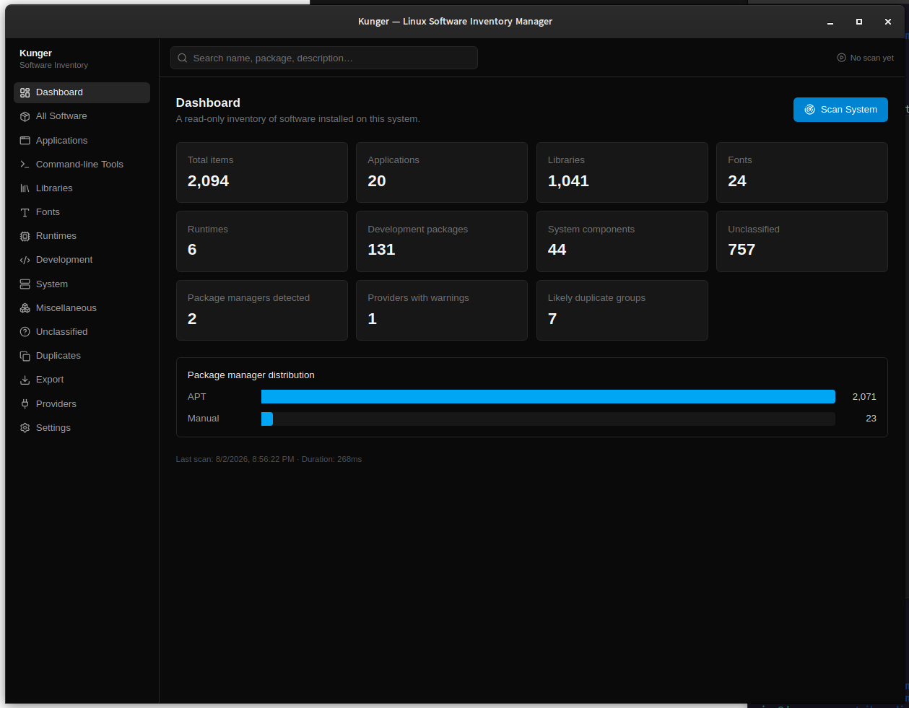
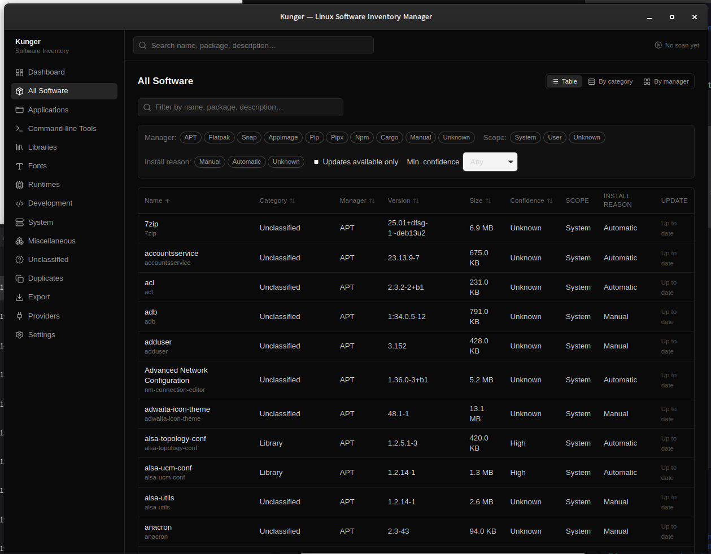
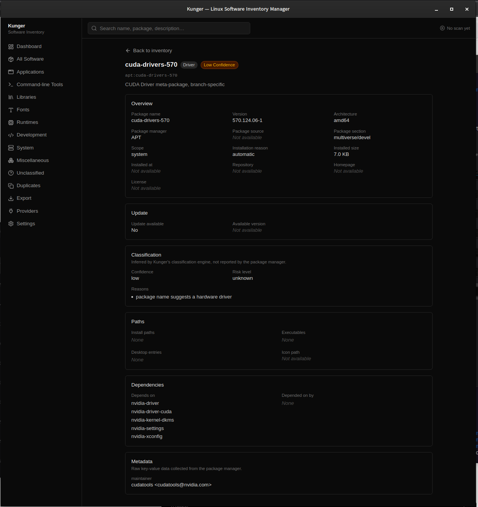
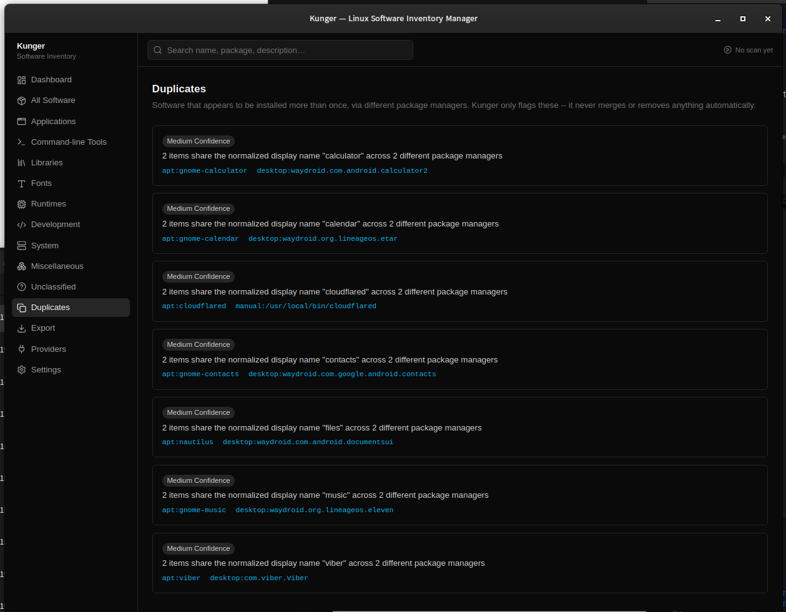
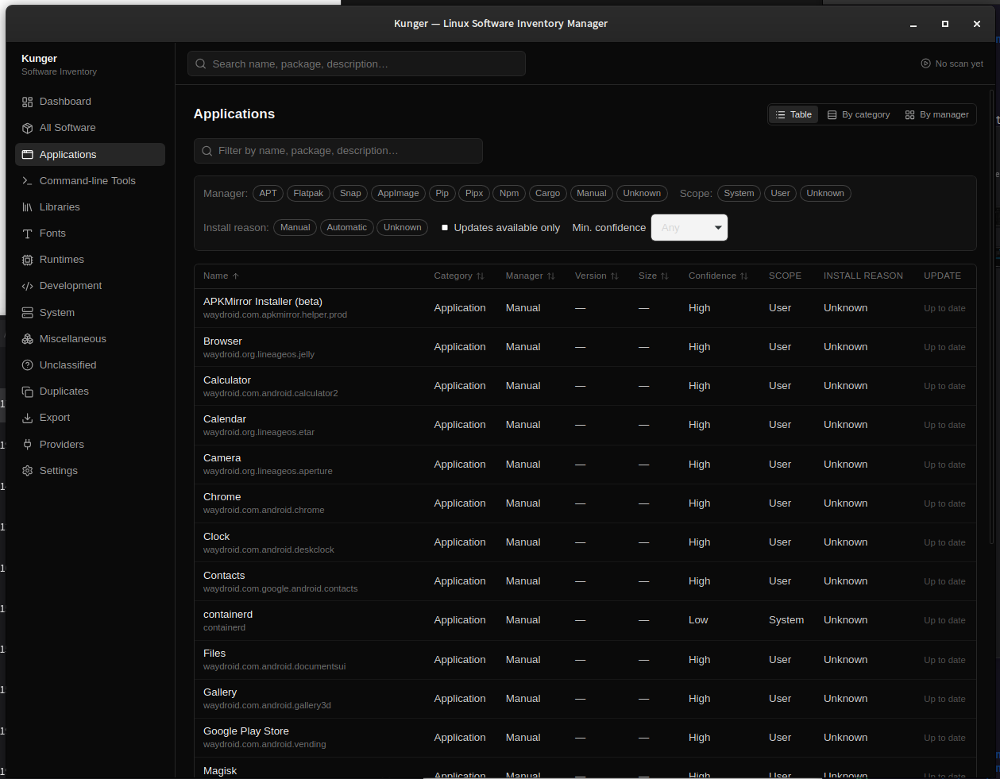
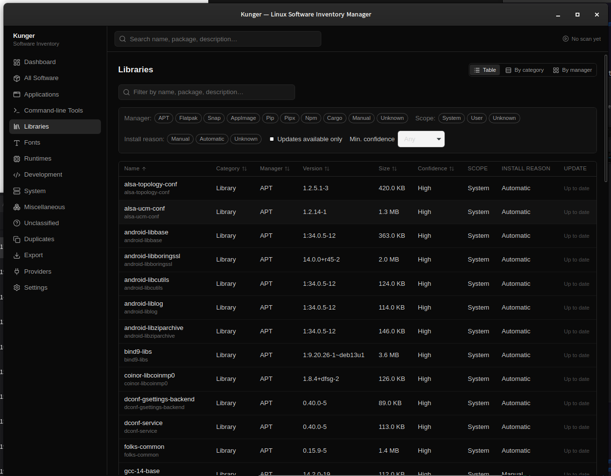
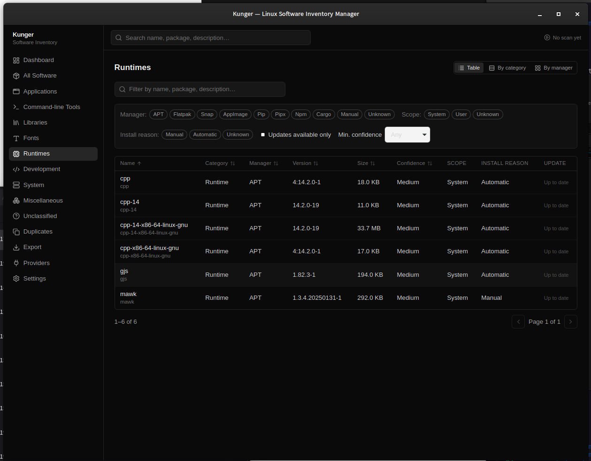
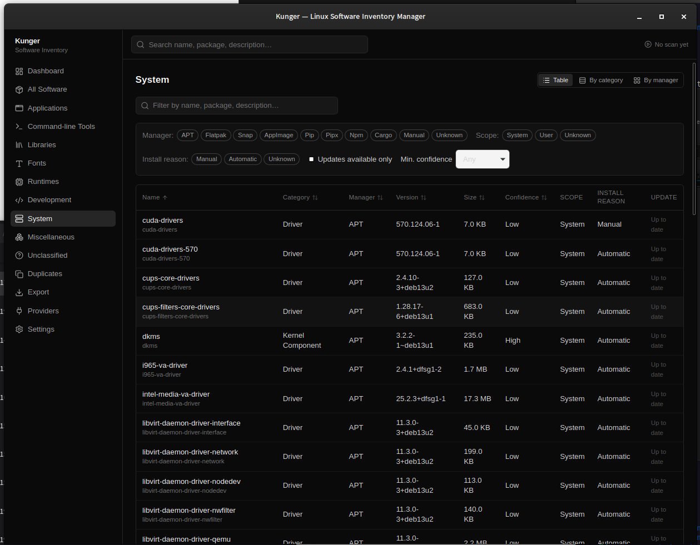

# Kunger

**Kunger** is a Linux desktop application that inventories installed software on Debian and
Ubuntu systems and organizes it by category (applications, libraries, fonts, runtimes,
development packages, and more) and by installation source (APT/dpkg, Flatpak, AppImage, manual
installs, and others).

Kunger is **not** a package manager or app store. It is a **read-only** inventory, ownership,
dependency, and system-inspection tool. It never installs, updates, or removes software, and it
never requires root privileges.

See [`docs/PRODUCT_SPEC.md`](docs/PRODUCT_SPEC.md) for the full product specification and
[`docs/ARCHITECTURE.md`](docs/ARCHITECTURE.md) for the technical design.

## Screenshots

All screenshots below are from a real scan on Debian (v0.1.0) — 2,094 items across APT and
manually-installed software, not sample data.

<p align="center">
  
</p>

<p align="center">
  
</p>

<p align="center">
  
</p>

<p align="center">
  
</p>

<details>
<summary>More screenshots — category views (Applications, Libraries, Runtimes, System)</summary>

<p align="center">
  
</p>
<p align="center">
  
</p>
<p align="center">
  
</p>
<p align="center">
  
</p>

</details>

## Status

v0.1.0, feature-complete for V1 — see [`RELEASE_NOTES.md`](RELEASE_NOTES.md) for what's included,
[`RELEASE_CHECKLIST.md`](RELEASE_CHECKLIST.md) for the acceptance-criteria verification behind
that claim, and [`KNOWN_ISSUES.md`](KNOWN_ISSUES.md) for what to know before relying on it.
Milestone history in [`TASKS.md`](TASKS.md).

## Technology

- [Tauri 2](https://tauri.app/) + Rust backend
- React + TypeScript + Tailwind CSS frontend
- SQLite for local caching
- Vitest (frontend) and Rust unit/integration tests (backend)

## Development

Prerequisites: Node.js 20+, Rust (stable, via `rustup`), and the Tauri system dependencies for
your platform (see [Tauri's prerequisites page](https://v2.tauri.app/start/prerequisites/) for
the authoritative, up-to-date list). On Debian/Ubuntu:

```bash
sudo apt update
sudo apt install libwebkit2gtk-4.1-dev \
  build-essential \
  curl \
  wget \
  file \
  libxdo-dev \
  libssl-dev \
  libayatana-appindicator3-dev \
  librsvg2-dev \
  libdbus-1-dev \
  libgtk-3-dev \
  pkg-config
```

`libdbus-1-dev` and `libgtk-3-dev` are both easy to miss — Tauri's documented Debian/Ubuntu
prerequisites list doesn't call them out explicitly, expecting `apt` to pull them in as
dependencies of `libwebkit2gtk-4.1-dev` automatically. That dependency resolution doesn't always
happen cleanly on every Debian variant/mirror state, so they're listed explicitly here.
`tao` (Tauri's window-management crate) depends on `dbus` and `gtk` unconditionally on Linux, and
the build fails with `libdbus-sys`/`dbus-1` or `gdk-sys`/`gdk-3.0` `pkg-config` errors without
them. If you still hit a `pkg-config`/`*-sys` build error after installing everything above, the
error message names the exact missing package — install that one too and retry; there may be
further transitive GTK/WebKit dependencies (e.g. `libjavascriptcoregtk-4.1-dev`,
`libsoup-3.0-dev`) that a particular Debian release's package split doesn't pull in automatically.

```bash
npm install       # install frontend dependencies
npm run tauri dev # run the app in development mode
```

### Checks

```bash
npm run lint         # ESLint
npm run format:check # Prettier
npm run typecheck    # TypeScript
npm test              # Vitest
npm run build         # production frontend build

cd src-tauri
cargo fmt --check
cargo clippy --all-targets --all-features
cargo test
```

CI (`.github/workflows/ci.yml`) runs all of the above on every push to `main` and every pull
request.

### Building packages

```bash
npm run tauri build -- --bundles appimage,deb
```

Produces an AppImage and a `.deb` under `src-tauri/target/release/bundle/`. Requires the Tauri
Linux build dependencies (see [prerequisites](https://v2.tauri.app/start/prerequisites/)) — this
only works on Linux, not macOS or Windows, since it links against `webkit2gtk`. Pushing a `v*` tag
(e.g. `v0.1.0`) runs `.github/workflows/release.yml`, which builds both bundles on Ubuntu and
attaches them to a draft GitHub Release.

## Documentation

- [`docs/PRODUCT_SPEC.md`](docs/PRODUCT_SPEC.md) — what Kunger does and does not do
- [`docs/ARCHITECTURE.md`](docs/ARCHITECTURE.md) — system design
- [`docs/DECISIONS.md`](docs/DECISIONS.md) — architecture decision log
- [`docs/CLASSIFICATION.md`](docs/CLASSIFICATION.md) — how software is categorized
- [`docs/SECURITY.md`](docs/SECURITY.md) — security model and constraints
- [`docs/SECURITY_REVIEW.md`](docs/SECURITY_REVIEW.md) — pre-release security review findings
- [`docs/TESTING.md`](docs/TESTING.md) — test suite coverage and quality gate
- [`docs/PERFORMANCE.md`](docs/PERFORMANCE.md) — performance review and measurements
- [`CONTRIBUTING.md`](CONTRIBUTING.md) — development workflow
- [`SECURITY.md`](SECURITY.md) — how to report a vulnerability

## License

Not yet decided.
